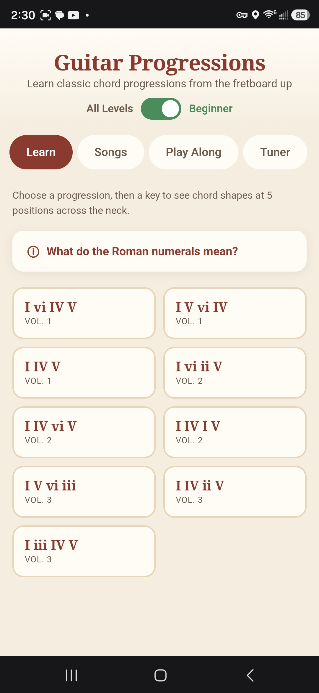
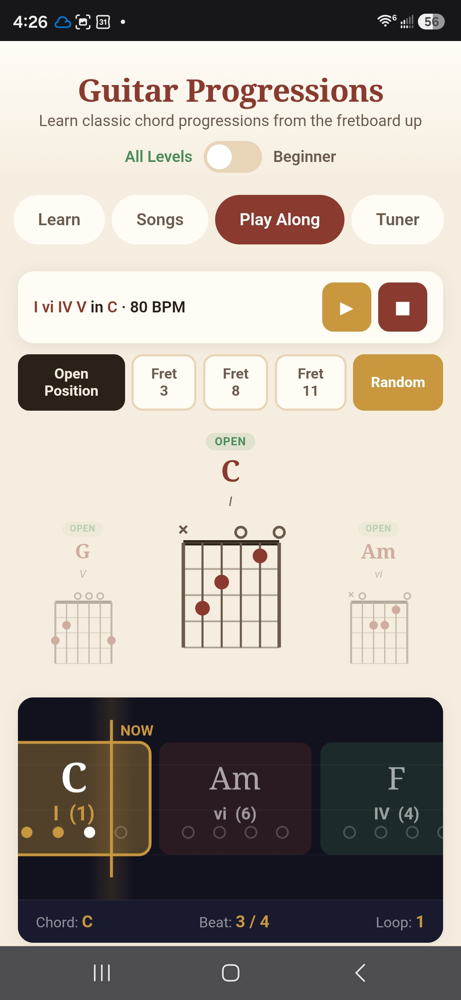
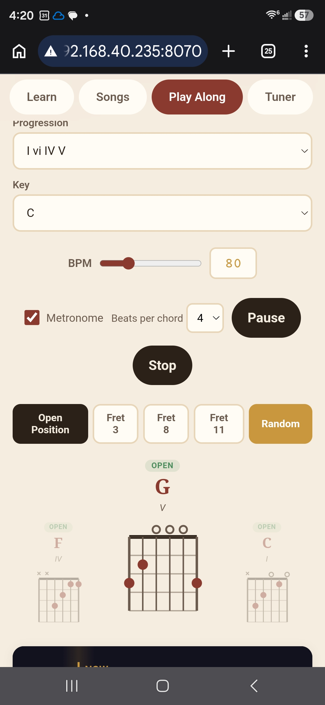

<p align="center">
  
  
  
  
</p>

# Guitar Progressions

A beautiful, mobile-first web app for learning guitar chord progressions. No frameworks, no build tools, no dependencies — just one self-contained HTML file with everything you need to learn, practice, and play along with classic chord progressions.

<p align="center">
  
  &nbsp;&nbsp;
  
  &nbsp;&nbsp;
  
</p>

## Why This Exists

I'm learning guitar and wanted a tool that actually shows me **where to put my fingers** — not just chord names flying by. This app was built to solve that problem: pick a progression, pick a key, and see every chord diagram at every neck position, then practice with a scrolling highway that shows you what's coming next.

## Features

### Learn Tab
- **9 classic chord progressions** from the most common patterns in popular music (I-V-vi-IV, I-IV-V, and more)
- **Interactive chord diagrams** with SVG fretboard rendering showing finger positions, open/muted strings, and barre indicators
- **5 neck positions** per progression — see the same chords played at different spots on the fretboard (CAGED system)
- **12 keys** — every progression in every key with real-time chord calculation
- **Beginner mode** — toggle to filter out keys that require barre chords, showing only open-chord-friendly keys
- **Difficulty tags** — each chord shape is labeled Open, Partial, or Barre so you know what you're getting into
- **Roman numeral explainer** — collapsible info card that teaches what I, ii, iii, IV, V, vi mean in plain English

### Songs Tab
- **45+ famous songs** organized by the progression they use
- Filter by progression to find songs that match what you're practicing
- One-tap **"Learn"** button jumps you to the chord shapes for that song's progression and key
- Songs from The Beatles, Adele, Bob Marley, Green Day, Journey, U2, and more

### Play Along Tab
- **Scrolling chord highway** — a Guitar Hero-style animated canvas that scrolls chords past a "NOW" line
- **Live chord diagrams** above the highway showing previous, current, and next chord shapes
- **Position picker** — lock all chords to one neck position (Open, Fret 3, Fret 6, etc.) for focused practice
- **Random mode** — randomizes the neck position for each chord change, forcing you to learn shapes across the entire fretboard
- **Adjustable BPM** (40–200) with slider and direct text input
- **Built-in metronome** with accented downbeats using Web Audio API
- **Configurable beats per chord** (2, 4, or 8)
- **Compact now-bar** — when playing, the setup controls collapse into a slim status bar showing "I vi IV V in C · 80 BPM" with pause/stop buttons
- **Beat tracking** — visual beat dots on the highway and a stats bar showing current chord, beat count, and loop number

### Tuner Tab
- **Reference tone generator** — tap any of the 6 strings (E2, A2, D3, G3, B3, E4) to hear the correct pitch
- **Triangle wave + harmonic** — uses a triangle wave with a quiet octave harmonic for a full, easy-to-hear tone
- **Microphone-based tuner** — uses pitch detection (autocorrelation algorithm) to analyze your playing in real-time
- **Visual tuning gauge** — semicircular gauge showing cents flat/sharp with a needle indicator
- **Flat/Sharp/In-tune feedback** — color-coded status display

## Tech Stack

Intentionally minimal:

- **One HTML file** — `index.html` contains all HTML, CSS, and JavaScript inline (~2200 lines)
- **Web Audio API** — metronome clicks, reference tones, and mic-based pitch detection
- **Canvas API** — 60fps scrolling highway animation via `requestAnimationFrame`
- **SVG** — chord diagram rendering with proper fret/string/finger positioning
- **Zero external dependencies** — no React, no npm, no build step, no CDN
- **CSS custom properties** — warm, light color palette (sand, rosewood, fret gold, maple)

## Quick Start

### Just open it

```bash
# Clone and open in your browser — that's it
git clone https://github.com/GeneArnold/guitar-app.git
open guitar-app/index.html
```

The app works as a local file — no server needed for basic functionality. (The tuner's microphone feature requires HTTPS or localhost.)

### Run with Docker

```bash
docker compose up -d
# App is now at http://localhost:8070
```

### Deploy your own

The Docker image is nginx:alpine serving a single HTML file. Point any reverse proxy at port 8070.

```bash
docker compose up -d --build
```

For HTTPS (required for microphone access on mobile), use a reverse proxy like Nginx Proxy Manager, Caddy, or Traefik.

## Mobile Experience

This app was designed phone-first. On a phone or iPad:

- All touch targets are 44px minimum (Apple HIG compliant)
- Tab navigation is horizontally scrollable
- Chord diagrams scale to fit the screen
- Play Along controls collapse into a compact bar when playing
- The 3-chord preview (previous / current / next) is sized for phone width
- Works great as a home screen bookmark — includes `apple-mobile-web-app-capable` meta tag

## Project Structure

```
guitar-app/
├── index.html          # The entire app (HTML + CSS + JS)
├── nginx.conf          # Nginx config with UTF-8 charset
├── Dockerfile          # nginx:alpine container
├── docker-compose.yml  # Port 8070 mapping
└── screenshots/        # App screenshots
```

## Music Theory Inside

The app implements chord progression theory algorithmically:

- **Major scale intervals** generate correct chord names for any key
- **Roman numeral mapping** (I = Major, ii = minor, etc.) follows standard music theory
- **CAGED system** voicing generation produces 5 positions across the neck
- **Open chord library** provides beginner-friendly shapes for C, D, E, F, G, A, Am, Dm, Em
- **Barre chord generation** uses E-shape and A-shape barre patterns with root transposition
- **Position scoring** groups voicings by fret proximity and penalizes barres for beginner mode

## Credits

Chord progression patterns and music theory concepts from the *Progressions: Classics* series by Jeffrey Kunde (The Guitar Institute).

## License

MIT
